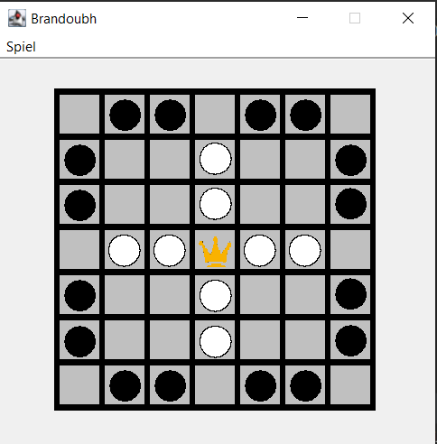
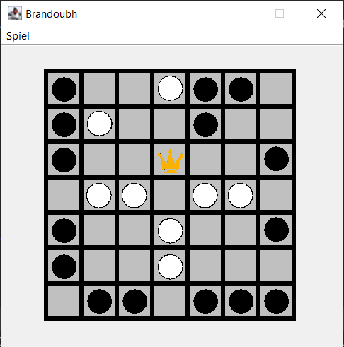
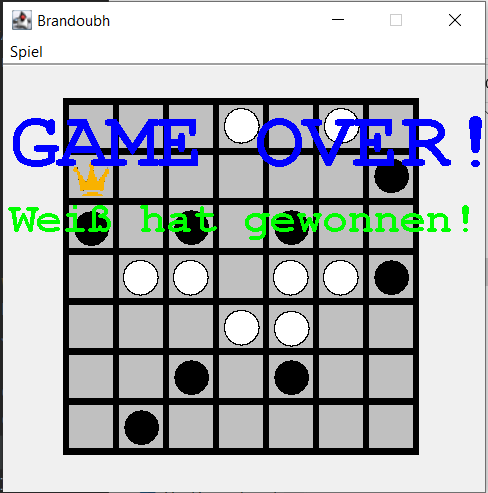
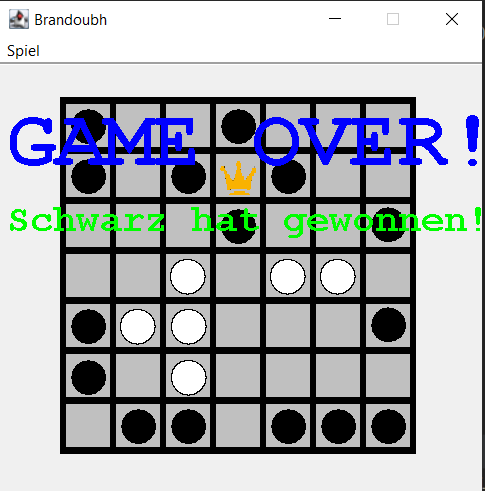
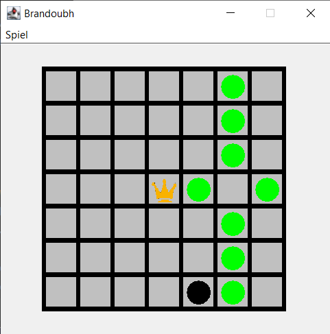

# Brandoubh
Little chess-like game i have developed around 2018 in Java using the Swing library.  
There is a game manual implemented within the game, however this is only available in german.

